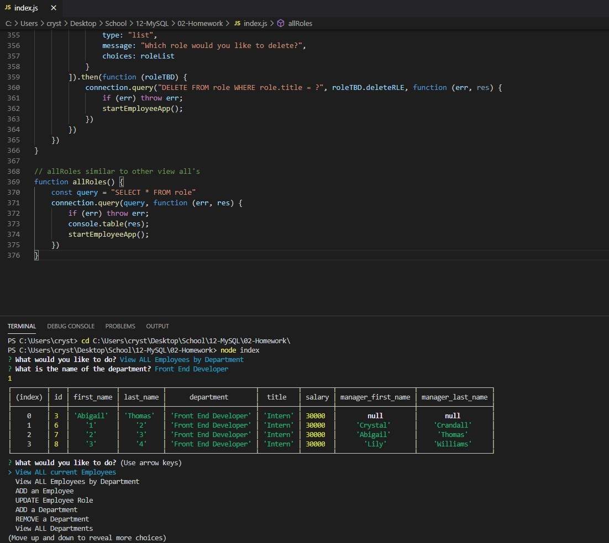

# OOP - Employee Template Engine

## Table of Contents
1. [Description](#description)
2. [Installation](#installation-instructions)
3. [Usage](#usage-information)
4. [Contribution](#contribution-guidelines)
5. [Test](#test-instructions)
6. [Questions & Contact](#questions?-contact-information-below)
### Description
This app is designed to take the user's input for an employee database using the employee's first and last name along with the manager in charge of said employee. It also includes their role, title, and salary.

### Installation Instructions
Download all files and properly install through npm. 
### Usage Information
Use "node index" to start the questions for the template.
### Contribution Guidelines
See contact information
### Test Instructions
"node index"
### Questions and Contact Information Below
#### Github Username: crystalcrandall92
#### Github Link: https://github.com/crystalcrandall92
#### Email: crystalcrandall92@yahoo.com

